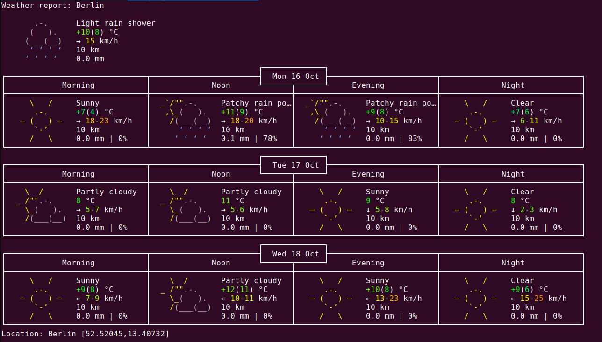

# Weather Analysis Toolkit (v0.1.0)

[](https://github.com/carecodeconnect/weather.git)
[](https://opensource.org/licenses/MIT)

This suite of scripts forms a toolkit for fetching, analyzing, and generating reports on weather data.

It assesses forecast accuracy over time and understanding weekly weather statistics.

This version of the toolkit reports today's weather and the forecast weather for tomorrow at noon in Berlin.

## Overview

The Weather Analysis Toolkit creates an ETL (Extract, Transform, Load) pipeline for enhanced forecasting accuracy.

The scripts **extract** temperature data from the `wttr.in` API for Berlin.



The scripts **transform** the data by filtering out extraneous information irrelevant to forecasting objectives.

The scripts **load** the data into reports which can inform decision-making.

## Scripts

1. `fetch_weather_data.sh`: This script is responsible for retrieving the latest weather data from `wttr.in`.

2. `analyse_forecast_accuracy.sh`: This script conducts an analysis of weather forecast accuracy, comparing forecasted data against actual weather outcomes.

3. `generate_weekly_weather_stats.sh`: This script generates a report summarizing weekly weather statistics, providing insights into trends and anomalies.

## Getting Started

These instructions will help you get the project up and running on your local machine for development and testing purposes.

### Prerequisites

- Unix-based operating system (Mac/Linux)

### Installation

Clone the repository to your local machine.

    `git clone https://github.com/carecodeconnect/weather.git`

Navigate to the project directory and give execution permissions to the scripts.

```bash
    cd path/to/repository
    chmod +x *.sh
```

## Usage

### Fetching Weather Data

To fetch the latest weather data, execute the following script:

```bash
    ./fetch_weather_data.sh
```

### Analyzing Forecast Accuracy

To analyze the accuracy of weather forecasts, use the following script:

```bash
    ./analyse_forecast_accuracy.sh
```

### Generating Weekly Weather Statistics

To generate a report on weekly weather statistics, execute the following script:

```
    ./generate_weekly_weather_stats.sh
```

## Acknowledgments

- Hat tip to the developers of the IBM Linux Command Line and Shell Scripting course on EdX.org for the original code

## License

This project is licensed under the terms of the MIT license. See the [LICENSE.md](LICENSE.md) file for details.

